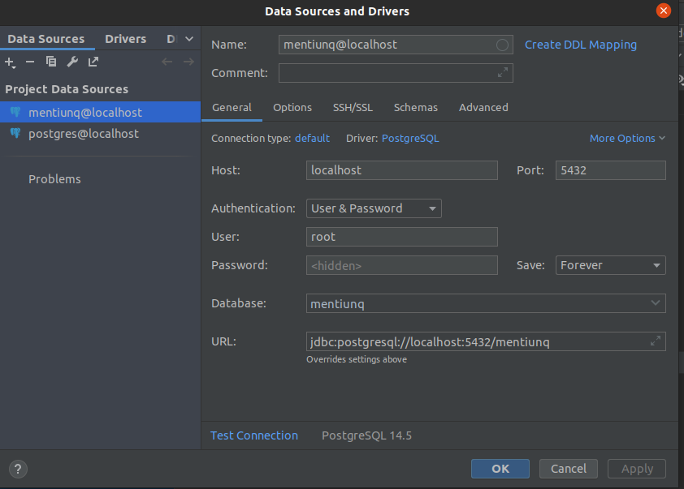

# Menti-UNQ backend

## Para correr la app:

En intellij se deben setear las VM options con `-Dspring.profiles.active={ambiente}}` , por ejemplo para correrlo , deberíamos usar `-Dspring.profiles.active=local`.

### Versiones
- Java SDK 11
- Springboot 2.7.3
- Maven 3.8.6

### Diagrama de clases

[Link al drive](https://app.diagrams.net/#G1YICNg5vj1PZvs2D5bFTnru9EpZPZcNd0)

## Docker

Para levantar el contenedor de postgres debemor correr `docker compose up` parados en el root del proyecto.
Podemos configurar DataGrip de la siguiente forma para crear la conexión

### Swagger

Acceder luego de levantar la app a: http://localhost:8080/swagger-ui.html